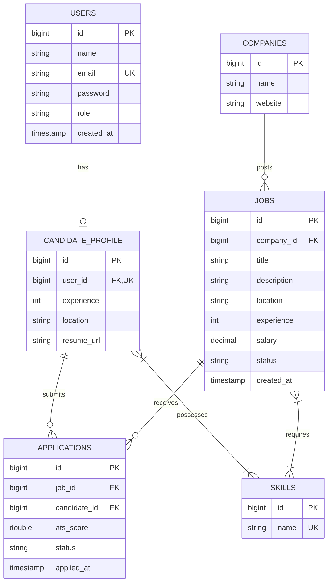

# JobPulse - AI-Powered Recruitment Platform (Backend MVP)


**JobPulse** is an enterprise-grade backend system for an AI-powered recruitment platform. It allows Recruiters to post jobs and evaluate candidate applications ranked automatically by a rule-based **ATS (Applicant Tracking System) match score**. Matching candidates can browse open roles, manage their skills profile, and submit one-click applications.

---

## Key Features

- **JWT Authentication & RBAC**: Role-based access control supporting `ADMIN`, `RECRUITER`, and `CANDIDATE` roles with BCrypt password hashing.
- **Job Posting Management**: Full CRUD operations for job postings with required skill specifications and status controls (`ACTIVE`/`INACTIVE`).
- **One-Click Candidate Application**: Streamlined candidate workflow with strict validation preventing double applications and applications to inactive jobs.
- **Rule-Based ATS Match Engine**: Automatic calculation of applicant suitability scores based on required vs. candidate skill overlaps.
- **Ranked Applicant Dashboard**: Recruiter view of job applications automatically sorted in descending order of ATS match score.
- **Database Schema Versioning**: Automated database versioning and baseline setup using Flyway.
- **Interactive OpenAPI Documentation**: Built-in Swagger UI for exploring and testing API endpoints.

---

## Tech Stack

| Component | Technology |
| :--- | :--- |
| **Language** | Java 17 / 21 |
| **Framework** | Spring Boot 3.3.2 (Spring Web, Spring Security, Spring Data JPA, Validation) |
| **Security** | Spring Security 6 + JJWT `0.12.5` |
| **Database** | PostgreSQL (Production/Dev), H2 (In-Memory Testing) |
| **Migrations** | Flyway 10.x |
| **Documentation** | Springdoc OpenAPI 2.5.0 (Swagger UI) |
| **Build & Test** | Maven, JUnit 5, Mockito, Spring Boot Test, MockMvc |
| **Utility** | Lombok, SLF4J Logging |

---

## Architecture & Package Structure

The system follows Clean Code and SOLID principles using standard Java layered package conventions:

```text
com.jobpulse
├── auth         # Authentication controllers, services, DTOs
├── user         # User entities, repositories, role management
├── company      # Company profile management
├── recruiter    # Recruiter specific domain logic
├── candidate    # Candidate profile management & skills linkage
├── job          # Job posting management, job skills, status controls
├── application  # Application submission & recruiter applicant rank view
├── skill        # Global skills catalog management
├── config       # Security, JPA Auditing, OpenAPI configuration
├── security     # JWT Filters, UserDetailsService, Token Provider
├── exception    # GlobalExceptionHandler and custom exceptions
├── common       # Shared DTOs and API response models
└── util         # Helper utilities (ATS scoring calculation)
```

---

## Database Design & ER Model

Database schema migrations are located in `src/main/resources/db/migration/V1__initial_schema.sql`.



---

## ATS Match Scoring Formula

For the MVP, ATS match calculation uses rule-based skill overlap scoring:

$$\text{ATS Score} = \left( \frac{\text{Matched Skills}}{\text{Required Skills}} \right) \times 100$$

### Example:
- **Required Job Skills**: `[Java, Spring Boot, PostgreSQL, Docker]` (4 skills)
- **Candidate Skills**: `[Java, Spring Boot, PostgreSQL]` (3 skills)
- **Calculation**: $\left( \frac{3}{4} \right) \times 100 = 75.0\%$

*Note: Skill comparisons are case-insensitive and normalized.*

---

## REST API Specifications

### Authentication API
| Method | Endpoint | Access | Description |
| :--- | :--- | :--- | :--- |
| `POST` | `/api/auth/register` | Public | Register a new Recruiter or Candidate |
| `POST` | `/api/auth/login` | Public | Authenticate user and return JWT bearer token |

### Recruiter Job Management API
| Method | Endpoint | Access | Description |
| :--- | :--- | :--- | :--- |
| `POST` | `/api/jobs` | `RECRUITER` | Create a new job posting with required skills |
| `PUT` | `/api/jobs/{id}` | `RECRUITER` | Update job posting details |
| `DELETE`| `/api/jobs/{id}` | `RECRUITER` | Deactivate/Delete job posting |
| `GET` | `/api/jobs/my` | `RECRUITER` | Get all jobs posted by the recruiter |
| `GET` | `/api/jobs/{id}/applications` | `RECRUITER` | **Get job applications sorted by ATS score DESC** |

### Candidate API
| Method | Endpoint | Access | Description |
| :--- | :--- | :--- | :--- |
| `GET` | `/api/jobs` | Public/Candidate | Browse all active job postings |
| `GET` | `/api/jobs/{id}` | Public/Candidate | Get detailed view of a job posting |
| `POST` | `/api/jobs/{id}/apply` | `CANDIDATE` | One-click apply to a job (calculates & stores ATS score) |
| `GET` | `/api/applications/me` | `CANDIDATE` | View candidate's submitted job applications |

### Skill Catalog API
| Method | Endpoint | Access | Description |
| :--- | :--- | :--- | :--- |
| `GET` | `/api/skills` | Public | List all available skills |
| `POST` | `/api/skills` | `RECRUITER`/`ADMIN` | Add a new skill to the global catalog |

---

## Getting Started

### Prerequisites
- **JDK 17 or Java 21**
- **Maven 3.8+**
- **PostgreSQL 15+** (Optional for local development; H2 is pre-configured for tests)

### Local Environment Setup

1. **Clone Repository**:
   ```bash
   git clone https://github.com/rohit-kumar-in/job-pulse.git
   cd job-pulse
   ```

2. **Configure Database Settings** (`src/main/resources/application.yml`):
   ```yaml
   spring:
     datasource:
       url: jdbc:postgresql://localhost:5432/jobpulse_db
       username: postgres
       password: postgres
   ```

3. **Build & Run**:
   ```bash
   mvn clean package
   mvn spring-boot:run
   ```

4. **Access Swagger API Documentation**:
   Open browser at `http://localhost:8080/swagger-ui.html`

---

## Running Automated Tests

Run the complete unit and integration test suite:

```bash
mvn clean test
```

### Test Coverage Highlights:
- **`AtsScoringServiceTest`**: Tests rule-based match calculation logic (75%, 100% case-insensitive, 0%).
- **`ApplicationServiceTest`**: Verifies business rules (single application per job, inactive job rejections).
- **`JobPulseIntegrationTest`**: End-to-end flow test using MockMvc verifying registration, job creation, application submission, and recruiter ranking.

---

## License

Distributed under the Apache 2.0 License. See `LICENSE` for details.
